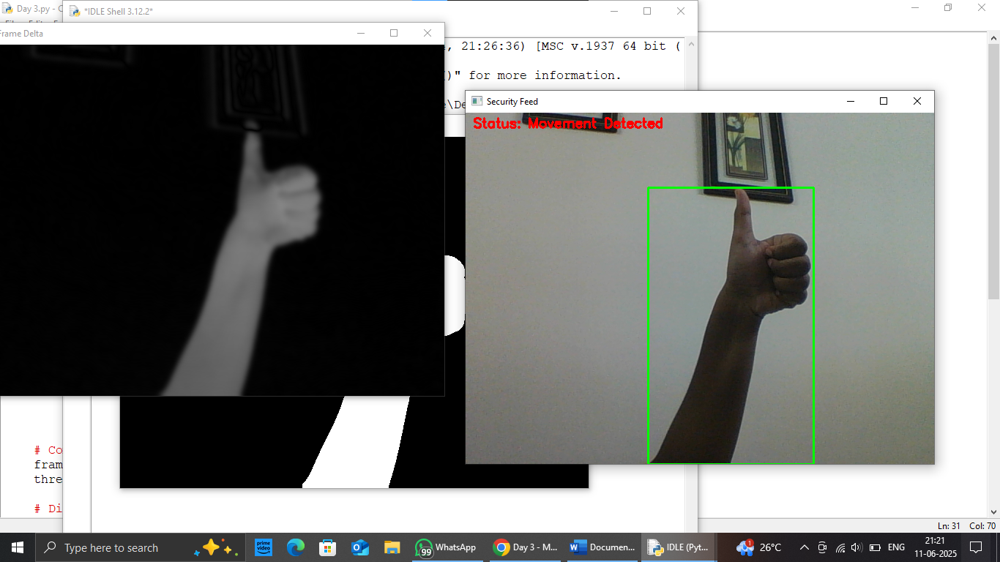

# Motion Detection Security System

## Overview

The **Motion Detection Security System** is a Python application that uses **OpenCV** to monitor live webcam footage and detect motion in real time. It compares consecutive video frames to identify movement, highlights detected objects with bounding boxes, and displays the current detection status on the video feed.

---

## Features

* 📹 Real-time webcam monitoring
* 🎯 Motion detection using frame differencing
* 🟩 Bounding boxes around detected movement
* 📊 Live status display (`Movement Detected` / `No Movement`)
* 🖥️ Multiple display windows:

  * Security Feed
  * Threshold
  * Frame Delta
* ⌨️ Press **Q** to exit the application

---

## Technologies Used

* Python 3
* OpenCV (`cv2`)

---

## How It Works

1. Captures live video from the webcam.
2. Converts each frame to grayscale.
3. Applies Gaussian Blur to reduce image noise.
4. Compares the current frame with the background frame.
5. Detects significant differences that indicate motion.
6. Draws bounding boxes around moving objects.
7. Displays the motion detection status in real time.

---

## Output

The application opens three windows:

* **Security Feed** – Displays the live webcam feed with motion detection.
* **Threshold** – Shows the binary image used for detecting movement.
* **Frame Delta** – Displays the difference between the background and current frame.

Press **Q** to close all windows and exit the program.

---

## Future Improvements

* Record video automatically when motion is detected.
* Save image snapshots during motion events.
* Send email or mobile notifications.
* Detect only humans using AI models such as **YOLO** or **MobileNet SSD**.
* Add timestamps to captured images and recorded videos.
* Improve background updating for better accuracy under changing lighting conditions.

## Demo

The application detects motion in real time using the webcam, highlights the detected object with a green bounding box, and displays the current detection status.

